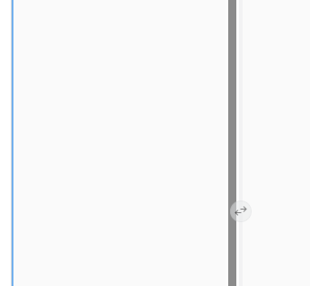
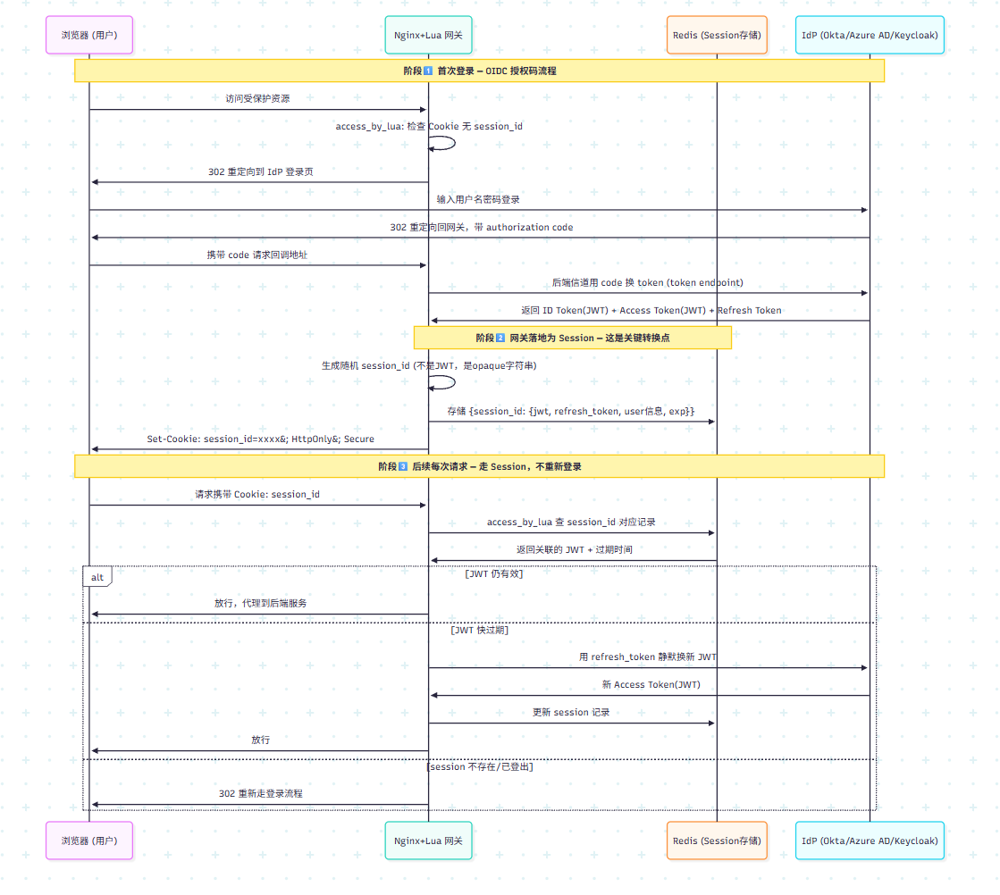

## 方法一：Page Bundle（推荐）

图片和文章放在同一个文件夹里，文章文件名必须是 `index.md`：

```plain
content/posts/how-to-add-screenshots/
├── index.md            ← 文章
└── terminal-demo.png   ← 截图
```

引用时直接写文件名：

```markdown

```

效果如下：






## 

## Windows 截图小技巧

按 `Win + Shift + S` 框选截图 → 打开"画图"或直接 `Ctrl+V` 到聊天窗口再另存，
最简单的做法是：截图后打开 **PowerToys**（或 Snipping Tool 的"另存为"），
把文件保存到文章文件夹里即可。

现在有了 /admin 后台，还可以直接在浏览器里粘贴截图发布。
