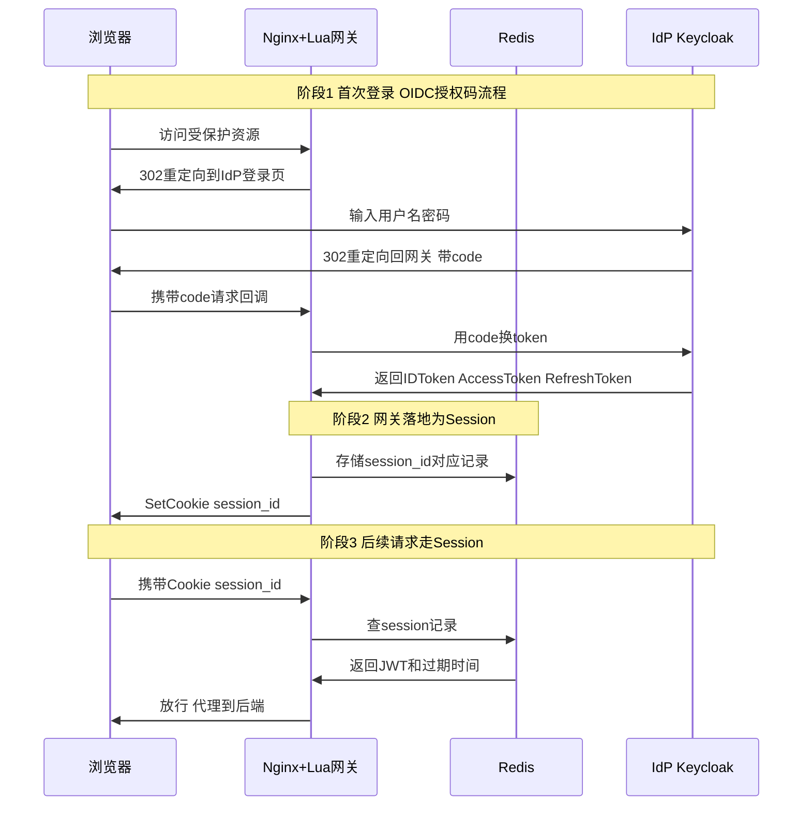

# SSO / OAuth2 / OIDC / JWT 技术笔记

## 1. 核心概念关系

| 概念 | 类型 | 解决什么问题 |
| --- | --- | --- |
| **OAuth2** | 授权协议（Authorization） | "A 应用能不能代表用户访问 B 的资源" — 产出 access token |
| **OIDC** | 建立在 OAuth2 之上的身份认证层（Authentication） | "你是谁" — 多返回一个 ID token(JWT) |
| **JWT** | Token 的编码格式 | header.payload.signature，自带签名可验证，不是协议 |
| **SSO** | 目标/场景 | 一次登录、多应用信任，本质是 OIDC 的典型应用 |

**关系链：** SSO（目标）→ 用 OIDC（协议）实现身份认证 → OIDC 建立在 OAuth2（授权框架）之上 → 两者的 token 常用 JWT（格式）承载。

***

## 2. Token vs Session

|  | JWT（无状态） | Session（有状态） |
| --- | --- | --- |
| 谁产生 | IdP 签发 | 网关自己生成 |
| 内容 | 自包含用户信息 + 签名 | 空壳 opaque 字符串，指向 Redis 记录 |
| 存哪 | 可给浏览器，也可只留服务端 | Redis/内存，浏览器只拿 id |
| 优势 | 无需查库，本地验签即可，扩展性好 | 可以主动失效（登出/踢下线立即生效） |
| 弱点 | 无法主动吊销 | 有状态，需要额外存储和查询 |

**session_id 本身不是 JWT**，它是一个随机不透明字符串（UUID/加密随机数），自己不携带信息，必须配合服务端存储（Redis）才有意义 —— 这是和自包含的 JWT 最本质的区别。

**返回位置：** 网关拿到 IdP 的 token 后生成 session_id，通过 `Set-Cookie: session_id=xxx; HttpOnly; Secure` 响应头返回给浏览器；真正的 JWT 留在服务端 Redis，不直接下发，减少 token 暴露面。

***

## 3. 为什么公司 SSO 选 Nginx + Lua

- **性能**：Lua 通过 OpenResty 嵌入 Nginx 请求处理阶段（`access_by_lua` 等），协程 + 非阻塞 I/O，鉴权逻辑延迟极低，不需要额外跳转到后端鉴权服务
- **入口拦截**：在流量入口就判断放行与否，减少后端压力
- **成熟生态**：`lua-resty-openidc`、`lua-resty-jwt`、`lua-resty-session` 封装好了 OAuth2/OIDC/JWT 校验和 session 管理
- **复用已有基础设施**：很多公司已用 Nginx 做反向代理/负载均衡，加 Lua 是顺手扩展
- **热更新**：Lua 脚本可不重启 Nginx 热加载

***

## 4. IdP 和 API Gateway 的分工

**不是同一个系统，职责完全不同：**

| 角色 | 职责 | 类比 |
| --- | --- | --- |
| **IdP**（Keycloak/Okta/Azure AD） | 权威身份源：存用户库、做认证（密码/MFA）、签发 token | 派出所（发身份证） |
| **API Gateway**（Nginx+Lua） | 流量入口 + 执行点：拦截请求、判断 session/token 是否有效、代理转发 | 小区门卫（查证件，没有就让你去派出所办证） |

网关不认识用户是谁，也没有用户数据库，只信任 IdP 签发的证件，自己维护一份登记表（Redis session）。这也是网关能高性能的原因——大部分请求只查自己的登记表或验签本地 JWT，只有登记表里没有/过期了才真的去问 IdP。

***

## 5. mTLS 和证书验证要点

- **SSO 场景通常不需要 mTLS**：用户浏览器登录走用户名密码 + 单向 TLS 即可
- **mTLS 常用场景**：服务间/机器对机器调用、零信任架构下的服务网格通信、金融/政企高安全内网
- **证书验证分两层**：
    - **TLS 握手层**（mTLS handshake 本身）→ 用 Nginx 原生 `ssl_verify_client`、`ssl_client_certificate`，不建议用 Lua 重写（安全关键路径，原生 OpenSSL 实现更可靠）
    - **业务级证书信息处理**（握手完成后取证书字段做进一步授权、自定义 CRL/OCSP）→ 用 `access_by_lua` 结合 `$ssl_client_s_dn` 等变量扩展，合理常见
- Keycloak 的 Client 配置里也有 mTLS 相关高级设置（要求 Client 用证书而非 secret 做认证）

***

## 6. Keycloak 关键界面结构

- **Realm**：独立租户空间，不同 Realm 之间用户/配置完全隔离
- **Clients**：注册"谁可以来做 OIDC 认证"，网关本身就是一个 Confidential Client（client_id + client_secret），配置 redirect_uri、Token 有效期
- **Users**：用户数据库，或通过 **User Federation** 对接 LDAP/AD
- **Roles / Groups**：权限模型，可映射进 JWT claim
- **Realm Settings → Endpoints**：OpenID Endpoint Configuration，即 discovery URL，`lua-resty-openidc` 用它自动发现 authorization_endpoint、token_endpoint、jwks_uri
- **Identity Providers**：如果 Keycloak 要联邦到上游 IdP（如企业微信/Google）

**配置流程：** Keycloak 建 Client 拿 client_id/secret → 网关 `lua-resty-openidc` 填 discovery URL + client_id/secret → 用户登录走 Keycloak Users/LDAP → 登录成功后 Keycloak 按 redirect_uri 把 code 送回网关 → 网关走 token 交换 + session 落地流程

***

## 7. 完整登录时序图

**Token 过期时的分支：**

- JWT 仍有效 → 直接放行
- JWT 快过期 → 用 refresh_token 静默换新 JWT → 更新 session 记录 → 放行
- session 不存在/已登出 → 重新走登录流程
