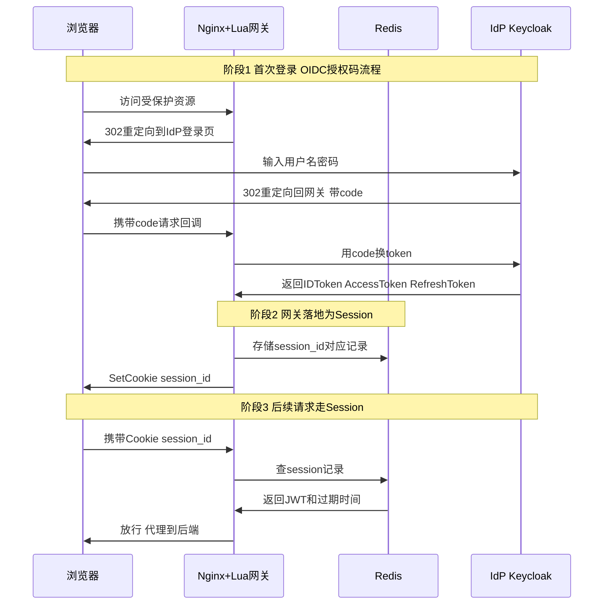
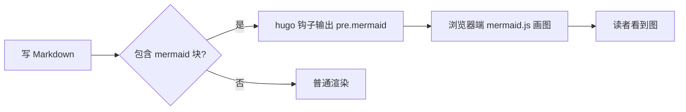

博客现在支持 **Mermaid** 图表了：只要在编辑器里插入一个语言为 `mermaid` 的代码块，写上图定义，发布后就会自动渲染成图（不是显示代码，是真的画出来）。

## 用法

在后台编辑器里：插入代码块 → 语言填 `mermaid` → 粘贴图定义。也可以把写好的定义直接 Ctrl+V 粘贴进去。

## 实测：OIDC 登录 + Session 时序图

下面这张就是你会在别的文章里用的那种时序图，直接照抄结构改内容即可：

## 其他图型速览

流程图（`graph LR` / `graph TD`）：

饼图、甘特图、类图也都可以，完整语法见 [mermaid.js.org](https://mermaid.js.org/)。

## 注意事项

- 代码块语言必须写 `mermaid`，写成 `plain` 或不写只会显示为普通代码
- 后台编辑器里看不到渲染效果是正常的（预览区只显示代码），发布后网站上才会画出来
- 语法写错时页面会显示报错提示而不是图，对照报错行号修一下即可
